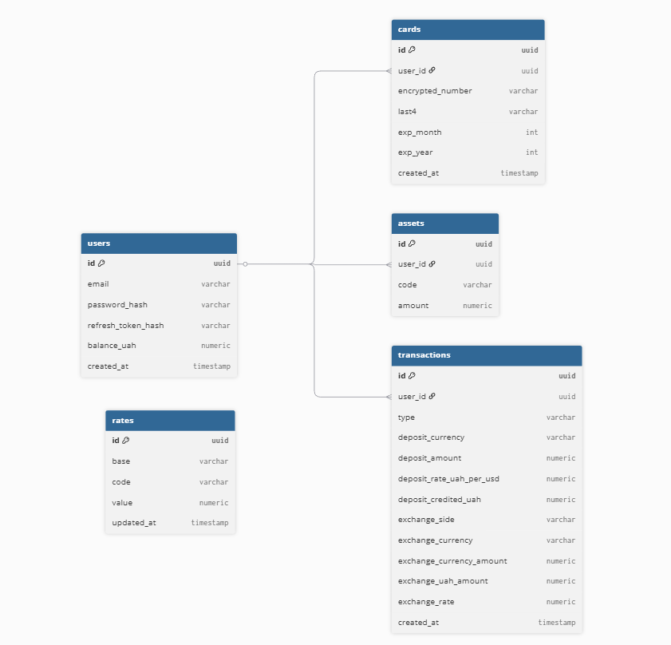

# Currency Exchange Backend (NestJS)

## Тема проєкту
Розробка backend-сервісу для обміну валют із використанням реальних курсів, JWT-авторизації та бази даних PostgreSQL.

---

## Опис проєкту
Проєкт є backend-частиною вебсервісу для обміну валют.  
Система надає можливість реєстрації та авторизації користувачів, роботи з кредитними картками, поповнення балансу в гривнях (UAH), купівлі та продажу іноземних валют за актуальними курсами, а також перегляду історії фінансових операцій.

Курси валют отримуються із зовнішнього API Monobank та автоматично оновлюються при старті застосунку і щогодини за допомогою cron-задач.  
Для забезпечення безпеки використовується JWT-аутентифікація з access та refresh токенами, які зберігаються у HttpOnly cookies.

Проєкт повністю контейнеризований за допомогою Docker і може бути запущений у будь-якому середовищі без додаткових налаштувань.

---

## Технологічний стек

### Backend
- Node.js  
- NestJS   

### База даних
- PostgreSQL  
- TypeORM  

### Авторизація та безпека
- JWT (Access token, Refresh token)  
- HttpOnly cookies  
- bcrypt (хешування паролів)  
- AES-256-GCM (шифрування номерів банківських карт)  

### Додаткові технології
- Swagger (OpenAPI)  
- Postman (тестування API)  
- Docker, Docker Compose  
- Cron jobs (оновлення курсів валют)  

---

## Основний функціонал

### Авторизація та користувачі
- Реєстрація користувачів  
- Вхід у систему  
- JWT-авторизація  
- Access token з терміном життя ~20 хвилин  
- Refresh token з більшим терміном життя  
- Унікальний email користувача  

### Профіль користувача
- Перегляд email користувача  
- Перегляд балансу в гривнях (UAH)  
- Перегляд доданих кредитних карт  
- Перегляд валютних активів (USD, EUR тощо)  

### Кредитні картки
- Додавання кредитної картки з валідацією:
  - номер карти (16 цифр)  
  - CVV (3 цифри, не зберігається в базі даних)  
  - термін дії у форматі MM/YY  
- Збереження номера карти у зашифрованому вигляді  
- Відображення лише останніх 4 цифр номера карти  

### Поповнення балансу
- Поповнення балансу з вибраної кредитної картки  
- Вибір валюти поповнення  
- Автоматична конвертація у гривні (UAH)  
- Збереження операції як транзакції типу `DEPOSIT`  

### Курси валют
- Отримання курсів валют із API Monobank  
- Збереження курсів у базі даних у нормалізованому вигляді  
- Базова валюта — USD  
- Оновлення курсів:
  - при старті застосунку  
  - щогодини за допомогою cron-задачі  

### Обмін валют
- Купівля іноземної валюти (BUY)  
- Продаж іноземної валюти (SELL)  
- Перевірка достатності балансу перед операцією  
- Ведення валютних активів користувача  
- Пошук валют за кодом (USD, EUR тощо)  

### Транзакції
- Збереження всіх фінансових операцій:
  - поповнення балансу (DEPOSIT)  
  - обмін валют (EXCHANGE: BUY / SELL)  
- Перегляд повної історії транзакцій  

---

## Налаштування середовища та запуск проєкту
Проєкт використовує Docker та Docker Compose і не потребує локального встановлення Node.js або PostgreSQL.  
Усі налаштування виконуються через файл `.env`.

---

## Файл `.env`
Перед запуском необхідно створити файл `.env` на основі шаблону `.env.example`.

### Кроки
1. Скопіювати вміст файлу `.env.example` у файл `.env`, присвоївши змінним коректні значення:

2. Запустити команду 
```bash
docker compose up --build
```
---
## ERD (Entity Relationship Diagram) 

